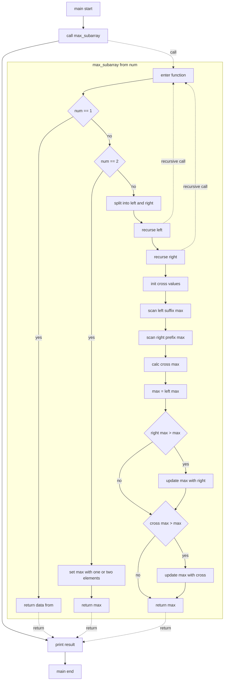
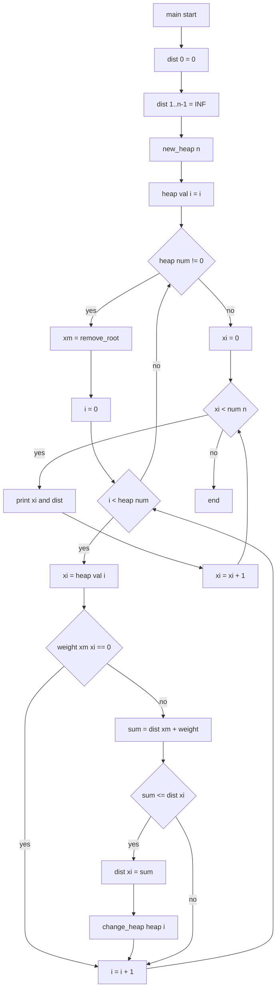
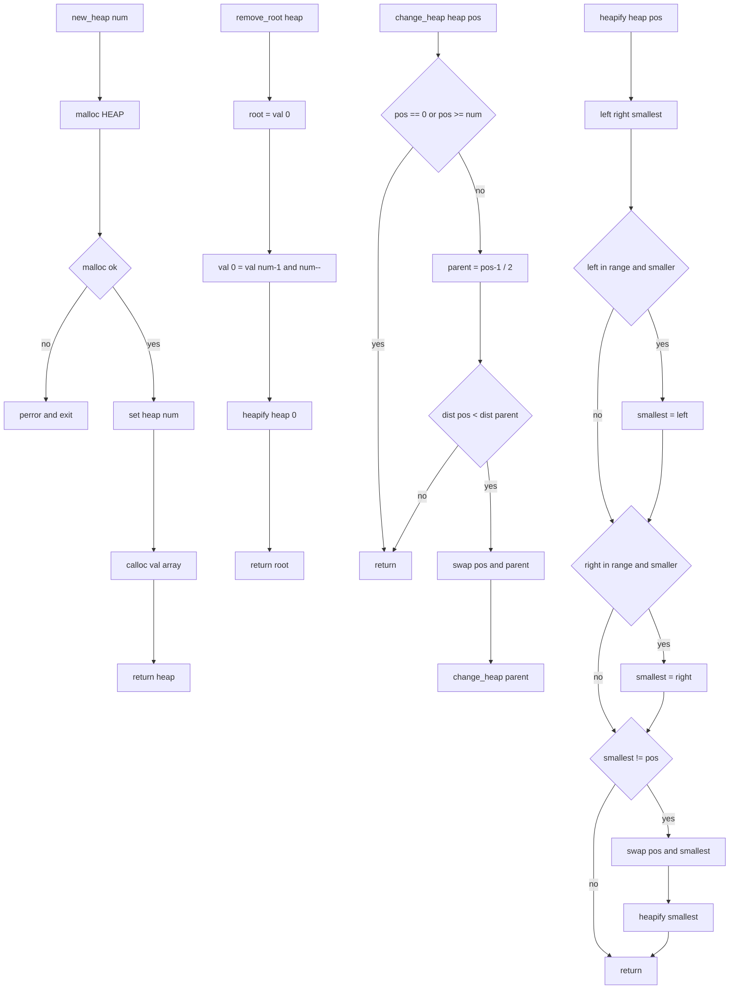

# 課題1
## MSP
### フローチャート

### プログラム
- [msp.c](msp/msp.c)
- [msp.h](msp/msp.h)

### テストデータ
- [data_0](msp/data/data_0.c)
- [data_1](msp/data/data_1.c)
- [data_2](msp/data/data_2.c)
- [data_3](msp/data/data_3.c)

### 実行結果
[test.sh](msp/test.sh)でコンパイルと実行を行いました。

[期待する実行結果](msp/data/excepted.txt)

[実際の実行結果](msp/data/result.txt)

diffコマンドで比較した結果、期待する実行結果と実際の実行結果は同一でした。

### 解説
- numが1のときは、その値が最大なので、data[from]を返します。
- numが2のときは、data[from]とdata[from + 1]とdata[from] + data[from + 1]の最大値を返します。
- numが2より大きいときは、配列を半分に分割して、左側と右側の最大値を再帰的に求めます。
- また、左側の末尾からの最大値と右側の先頭からの最大値を求めて、それらの和をcross_maxとします。
- 各cross_maxは一時的に端の値を入れているが、範囲に含まれる要素ならなんでもよいです。
- sumの値midから離れるように追加されています。
- 最後に、左側の最大値、右側の最大値、cross_maxの中で最大の値を返します。
- data_1~3は自分で作成したテストデータで、kadaneのアルゴリズムで求めた最大値を期待する実行結果に記載しています。

## Dijkstra
### フローチャート

### プログラム
- [dijkstra.c](dijkstra/dijkstra.c)
- [dijkstra.h](dijkstra/dijkstra.h)
- [heap.c](dijkstra/heap.c)
- [heap.h](dijkstra/heap.h)

### テストデータ
- [data_0](dijkstra/data/data_0.c)
- [data_1](dijkstra/data/data_1.c)
- [data_2](dijkstra/data/data_2.c)
- [data_3](dijkstra/data/data_3.c)

### 実行結果
[test.sh](dijkstra/test.sh)でコンパイルと実行を行いました。

[期待する実行結果](dijkstra/data/excepted.txt)

[実際の実行結果](dijkstra/data/result.txt)

diffコマンドで比較した結果、期待する実行結果と実際の実行結果は同一でした。

### 解説
- dist配列は、各ノードへの最短距離を保持します。
- 最初に、dist[0]を0に設定し、他のノードへの距離を無限大に設定します。
- ヒープを作成し、各ノードをヒープに追加します。
- ヒープが空になるまで、最小の距離を持つノードをヒープから取り出し、そのノードから隣接するノードへの距離を更新します。
- 更新された距離が現在の距離より小さい場合、dist配列を更新し、ヒープ内の位置を変更します。
- 最後に、各ノードへの最短距離を出力します。
- data_1~3は自分で作成したテストデータで、PythonでDijkstraのアルゴリズムを実装して求めた最短距離を期待する実行結果に記載しています。
