# 課題2
## 赤黒木

### プログラム
- [main.c](main.c) (動作確認用)
- [rbtree.c](rbtree.c)
- [rbtree.h](rbtree.h)

### 関数ごとのフローチャート

#### `rb_create`
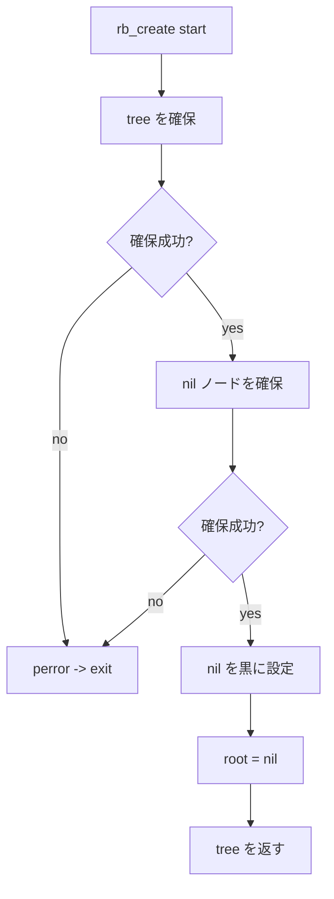

#### `rb_search`
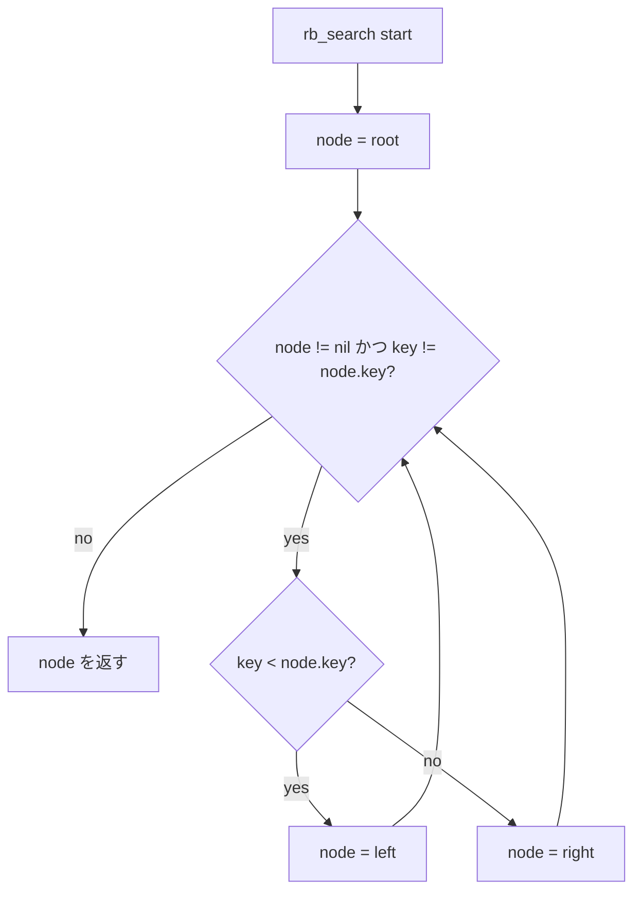

#### `rb_insert`
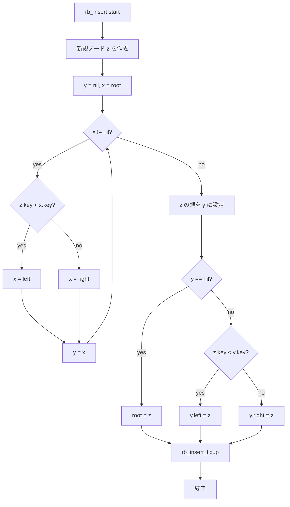

#### `rb_insert_fixup`
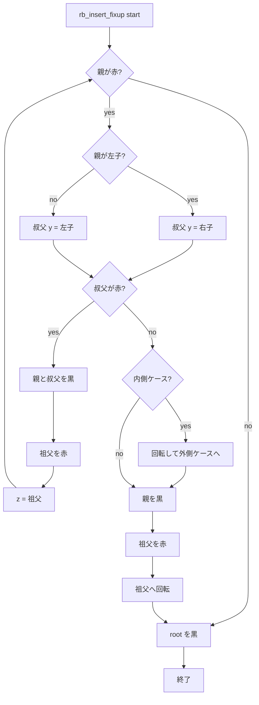

#### `rb_left_rotate`
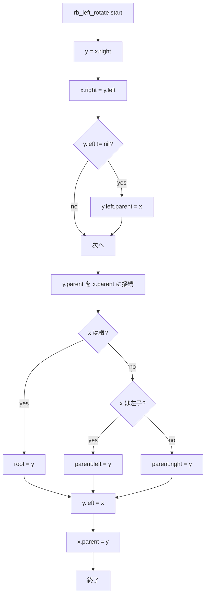

#### `rb_right_rotate`
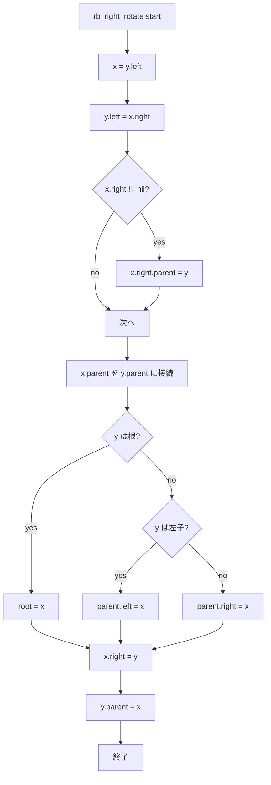

#### `rb_transplant`
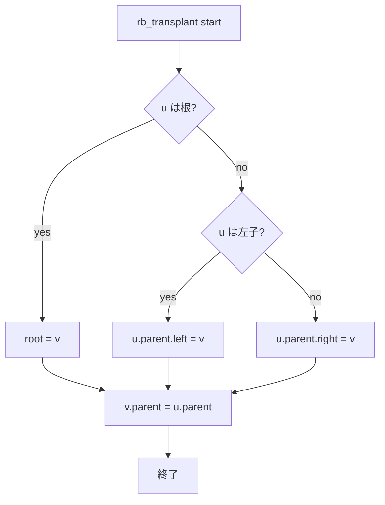

#### `rb_minimum`
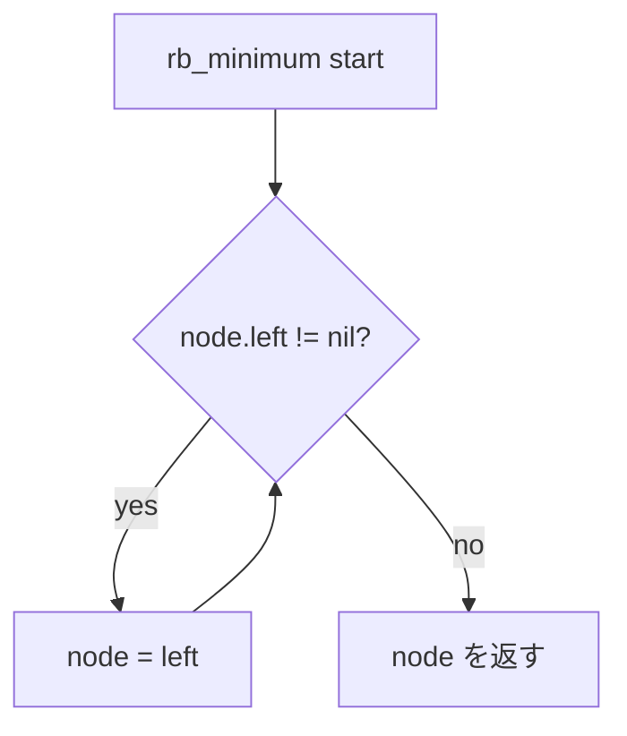

#### `rb_delete`
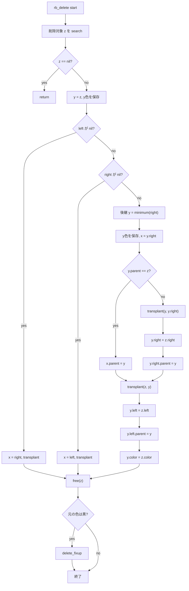

#### `rb_delete_fixup`
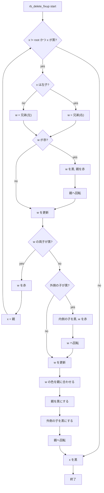

#### `rb_free`
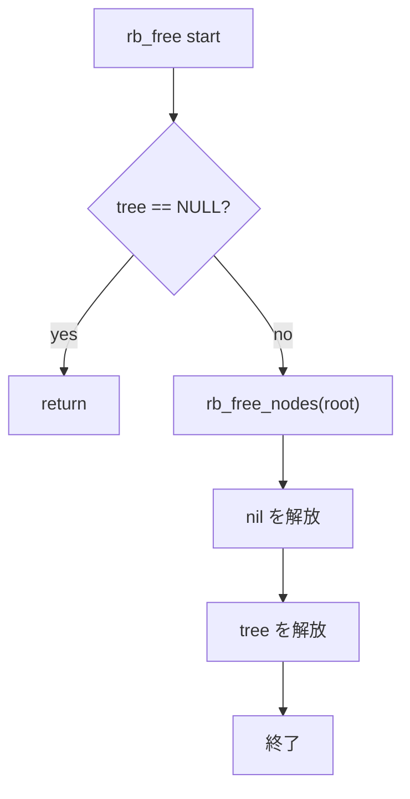

#### `rb_print`
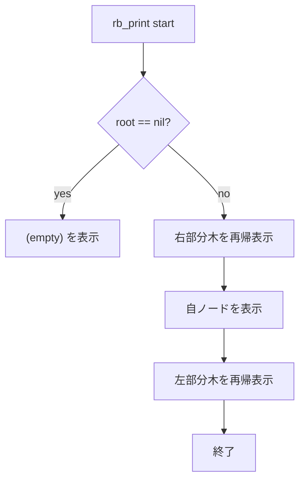

### 実行結果
`test.sh` でコンパイルと実行を行った。  
結果は `result.txt` に保存した。

#### 挿入の経過

`7` 挿入後


`4` 挿入後
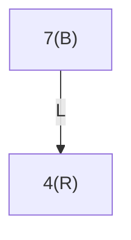

`3` 挿入後
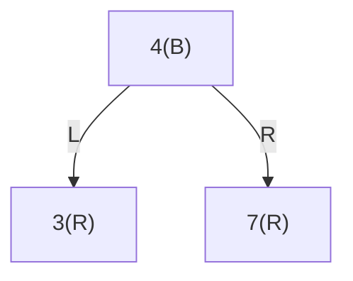

`1` 挿入後


`5` 挿入後
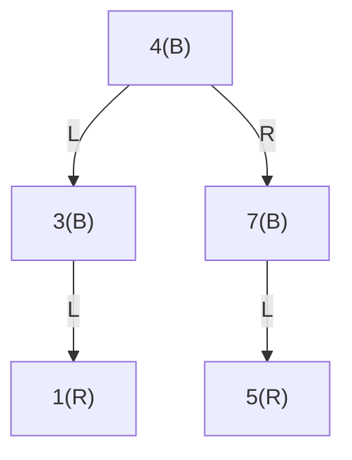

`2` 挿入後
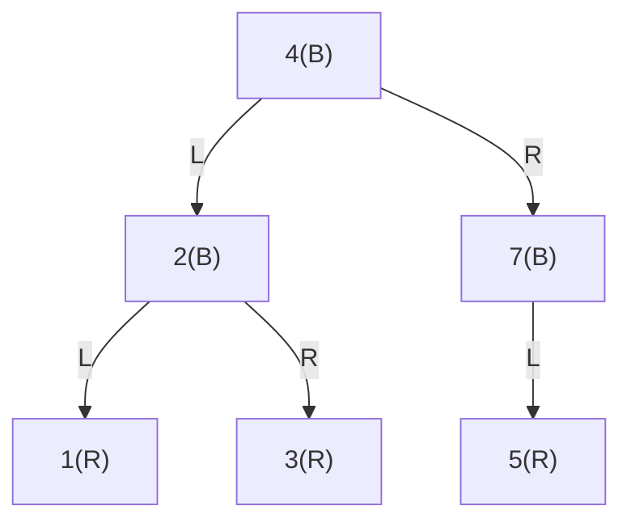

#### 探索の結果
```text
search 3: found (3,R)
search 6: not found
```

#### 削除の経過

`2` 削除後


`4` 削除後
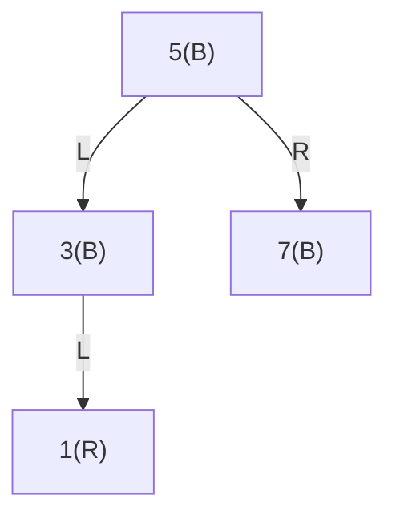

`7` 削除後
```mermaid
flowchart TB
N5["5(B)"]
N5 -->|L| N3["3(B)"]
N3 -->|L| N1["1(B)"]
```

`3` 削除後
```mermaid
flowchart TB
N5["5(B)"]
N5 -->|L| N1["1(R)"]
```

`5` 削除後
```mermaid
flowchart TB
N1["1(B)"]
```

`1` 削除後
```mermaid
flowchart TB
E["(empty)"]
```

### 解説
- 赤黒木は二分探索木に色の制約を追加した構造で、挿入と削除のたびに回転と再配色で平衡を保つ。
- 挿入では、まず赤で追加してから親・叔父・祖父の関係を見て修正する。
- 削除では、削除対象の色が黒のときだけ黒高さの崩れを修正する。
- 探索は通常の二分探索木と同じで、値の大小だけで左右に降りていく。
