# 課題3

## 2-3木

### フローチャート

#### `min_keys_for_height(height)`


#### `max_keys_for_height(height)`
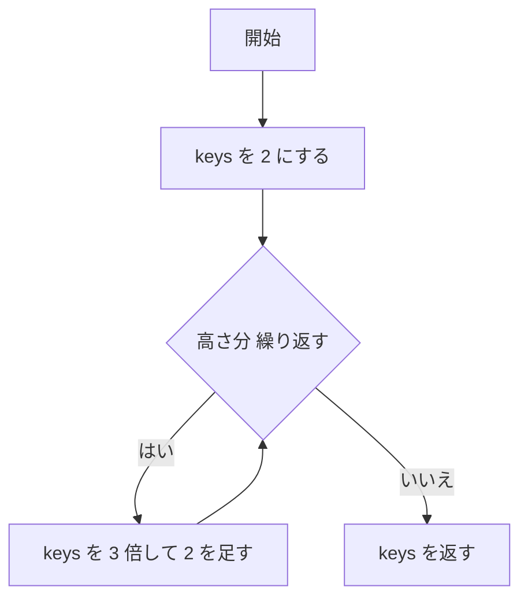

#### `destroy(node)`
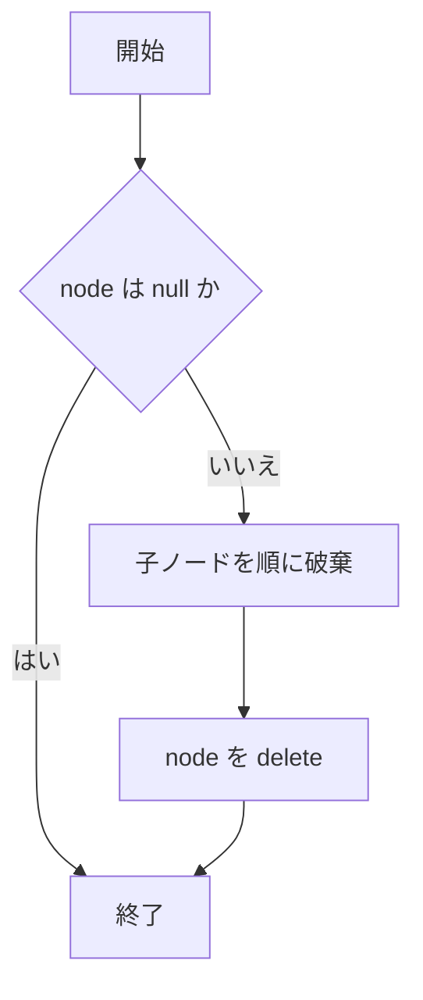

#### `partition_count(total, parts, min_part, max_part, out)`
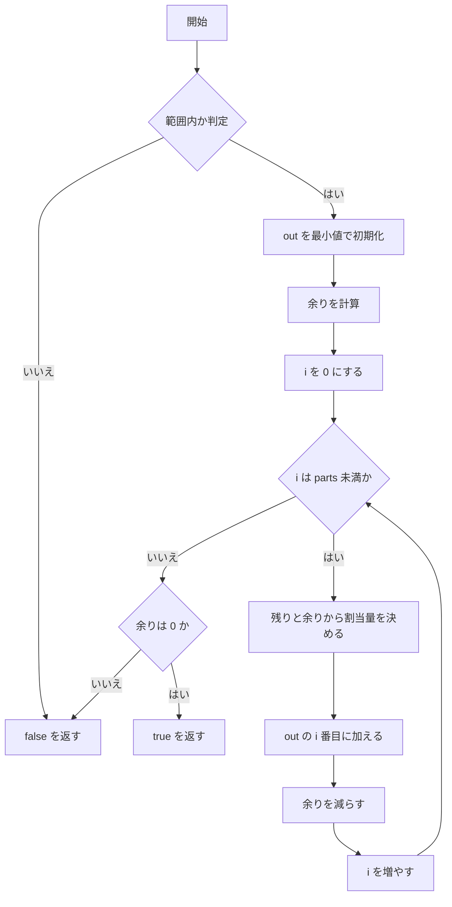

#### `build_subtree(arr, l, r, height)`
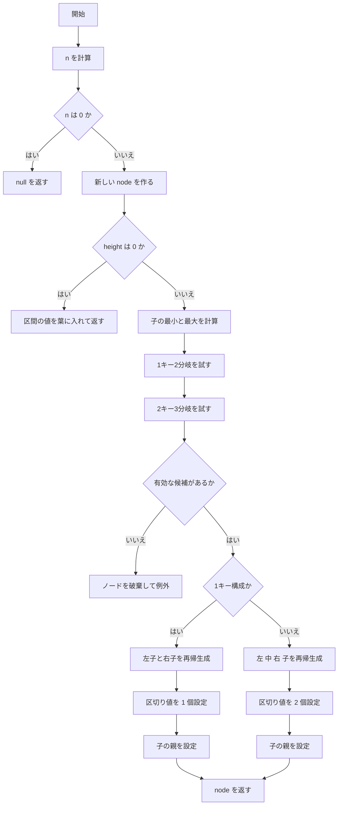

#### `search_node(node, key)`
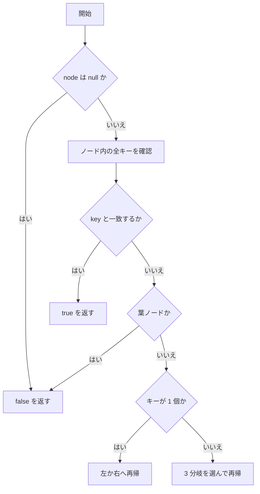

#### `rebuild()`
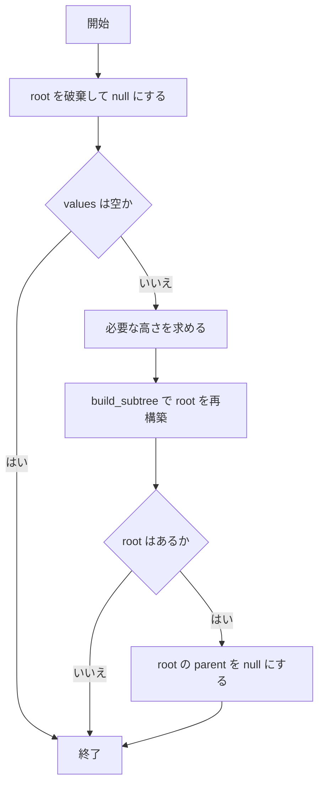

#### `repeat_char(c, n)`
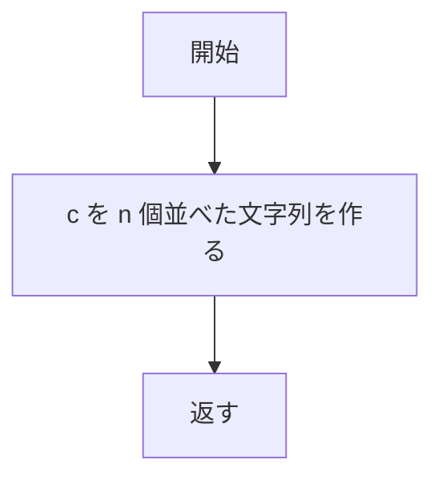

#### `to_utf8(s)`
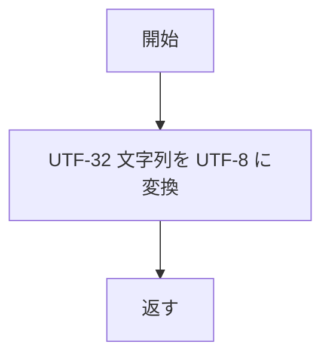

#### `make_label(node)`
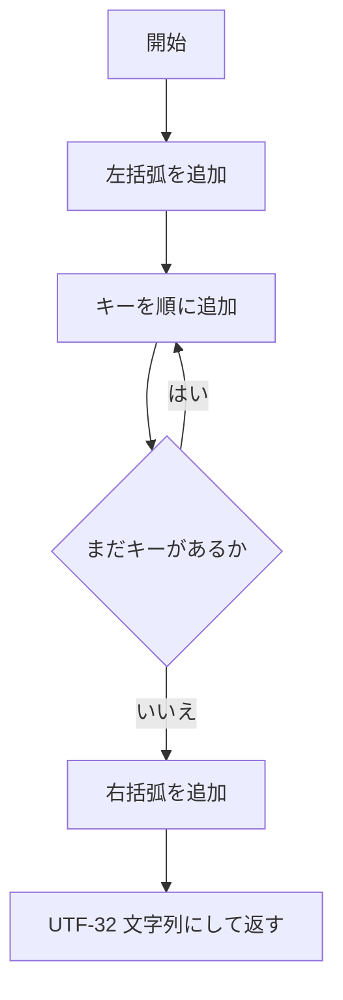

#### `render_box(node)`
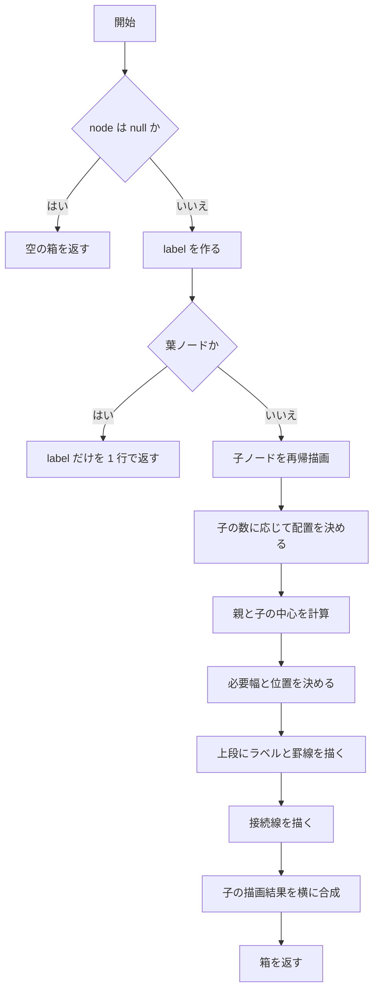

#### `print_rendered(box)`
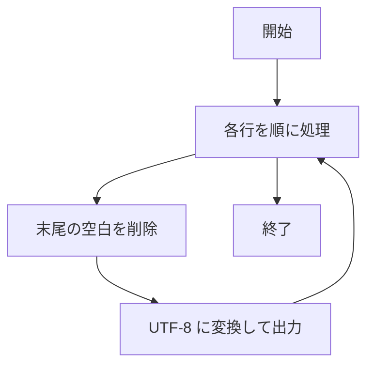

#### `TwoThreeTree::~TwoThreeTree()`
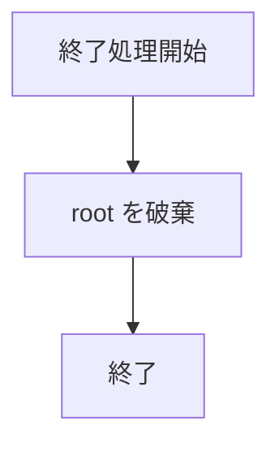

#### `insert(key)`
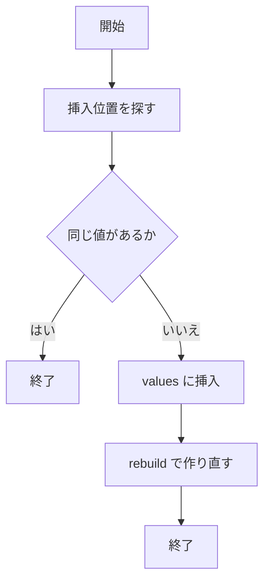

#### `search(key)`
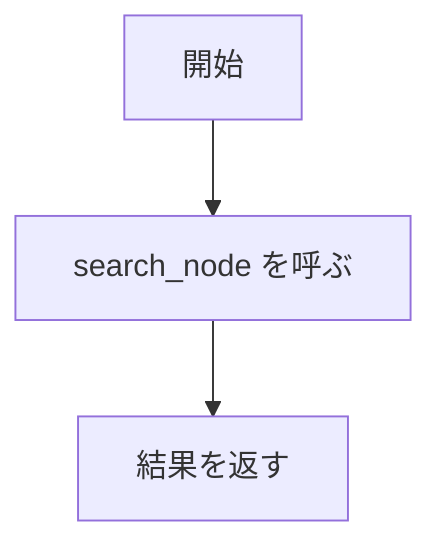

#### `print_search_trace(key)`
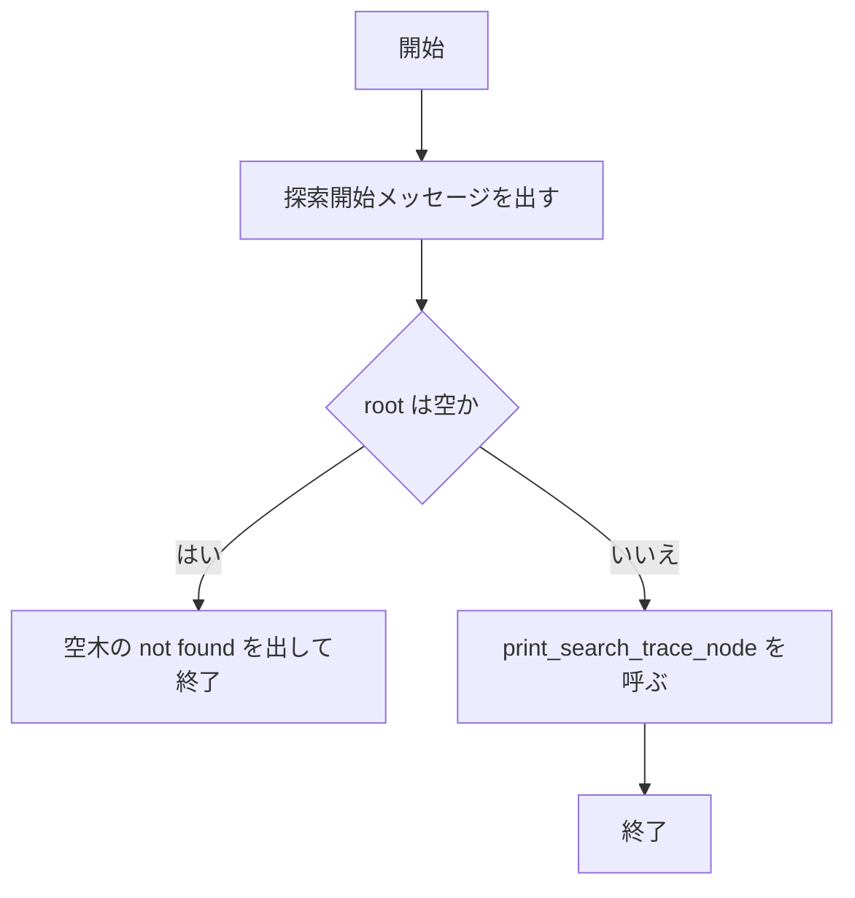

#### `print()`
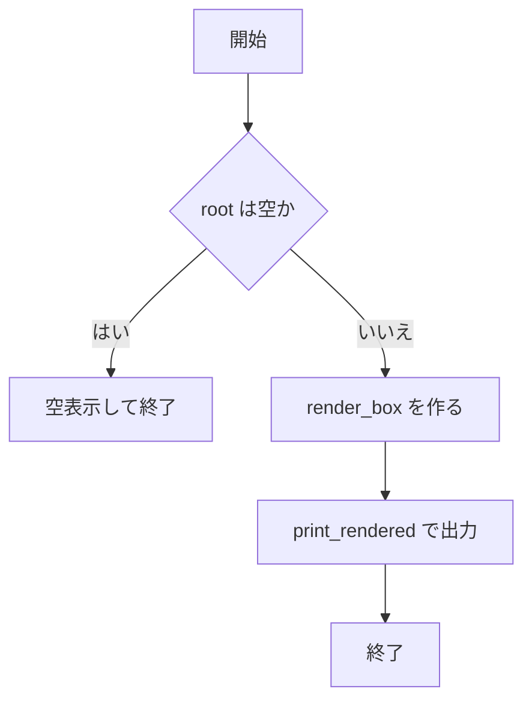

#### `print_search_trace_node(node, key, depth)`
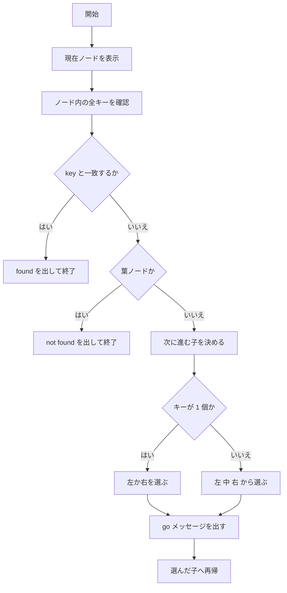

#### `remove(key)`
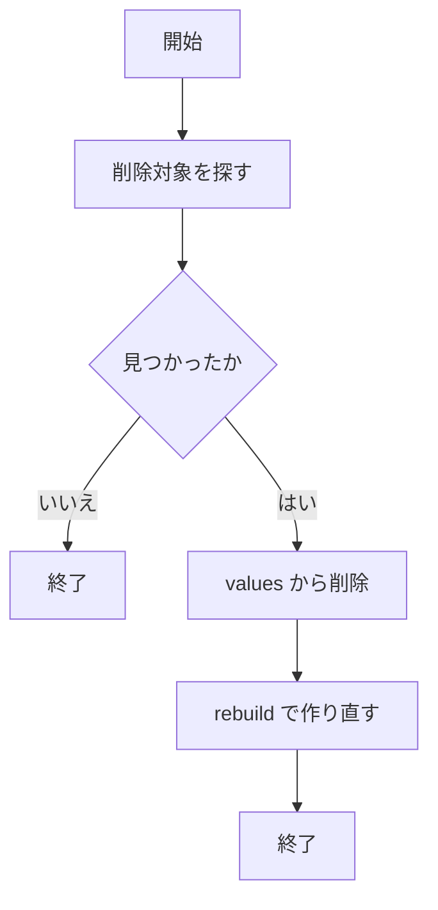

#### `main()`
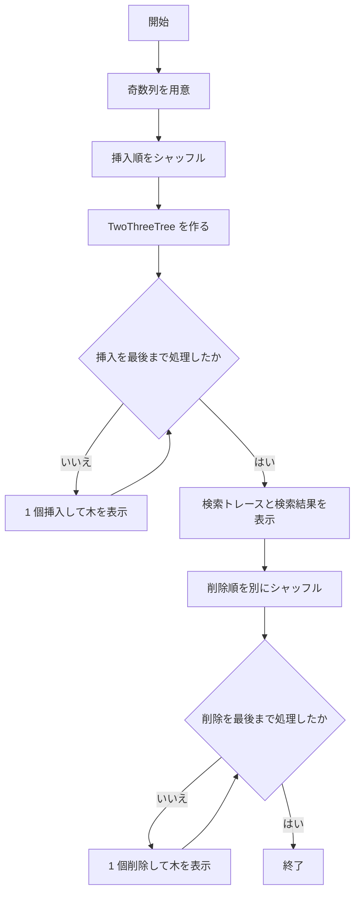

### 解説


## パトリシア木

### フローチャート

#### `makeEndMarker()`
```mermaid
graph TD
    A[開始] --> B[# を 1 個だけ持つ描画用ノードを返す]
```

#### `trimRight(row)`
```mermaid
graph TD
    A[開始] --> B{末尾が空白か}
    B -->|はい| C[末尾を 1 文字削除]
    C --> B
    B -->|いいえ| D[終了]
```

#### `putText(grid, row, col, text)`
```mermaid
graph TD
    A[開始] --> B[text の各文字を順に処理]
    B --> C{書き込み位置が範囲内か}
    C -->|はい| D[grid に 1 文字ずつ格納]
    C -->|いいえ| E[その文字は無視]
    D --> B
    E --> B
    B --> F[終了]
```

#### `cellWidth(text)`
```mermaid
graph TD
    A[開始] --> B{罫線文字か}
    B -->|はい| C[幅 1 を返す]
    B -->|いいえ| D[文字列長を返す]
```

#### `putToken(grid, row, col, token)`
```mermaid
graph TD
    A[開始] --> B{位置が範囲内か}
    B -->|はい| C[grid に token を置く]
    B -->|いいえ| D[何もしない]
    C --> E[終了]
    D --> E
```

#### `renderTree(node, is_root)`
```mermaid
graph TD
    A[開始] --> B{node はあるか}
    B -->|いいえ| C[空の描画結果を返す]
    B -->|はい| D[label を決める]
    D --> E{葉ノードか}
    E -->|はい| F[label だけを 1 行で返す]
    E -->|いいえ| G[子ノードを再帰描画]
    G --> H[子の数に応じて配置を決める]
    H --> I[親ラベルと子の中心を計算]
    I --> J[必要な幅と位置を決める]
    J --> K[上段にラベルと横線を描画]
    K --> L[接続行に縦線を描画]
    L --> M[子の描画結果を横に合成]
    M --> N[描画結果を返す]
```

#### `erase(node, word, depth)`
```mermaid
graph TD
    A[開始] --> B[各子を順に見る]
    B --> C[子ラベルと word の一致長を調べる]
    C --> D{ラベル全体が一致したか}
    D -->|いいえ| B
    D -->|はい| E{word の末尾まで来たか}
    E -->|はい| F{子が終端か}
    F -->|いいえ| G[削除失敗で false]
    F -->|はい| H[終端フラグを下ろす]
    H --> I{子に子ノードがないか}
    I -->|はい| J[子を削除して親から除去]
    J --> K[true を返す]
    I -->|いいえ| L{子が 1 個だけか}
    L -->|はい| M[孫を持ち上げてラベルを結合]
    M --> K
    L -->|いいえ| K
    E -->|いいえ| N[一致した子へ再帰]
    N --> O{再帰が成功したか}
    O -->|いいえ| G
    O -->|はい| P{子が空になったか}
    P -->|はい| J
    P -->|いいえ| Q{子が 1 個だけか}
    Q -->|はい| M
    Q -->|いいえ| K
```

#### `PatriciaTree::PatriciaTree()`
```mermaid
graph TD
    A[開始] --> B[root に空ノードを確保]
    B --> C[終了]
```

#### `PatriciaTree::~PatriciaTree()`
```mermaid
graph TD
    A[終了処理開始] --> B[root を deleteTree で破棄]
    B --> C[終了]
```

#### `deleteTree(node)`
```mermaid
graph TD
    A[開始] --> B{node はあるか}
    B -->|いいえ| C[終了]
    B -->|はい| D[全子を順に deleteTree]
    D --> E[node を delete]
    E --> C
```

#### `insert(word)`
```mermaid
graph TD
    A[開始] --> B[node を root にする]
    B --> C{i は word の長さ未満か}
    C -->|いいえ| D[終端を true にして終了]
    C -->|はい| E[先頭文字の子を探す]
    E -->|いいえ| F[残り文字列を新しい子として追加]
    F --> G[終了]
    E -->|はい| H[既存子ラベルと word を比較]
    H --> I{ラベル全体が一致したか}
    I -->|はい| J[その子へ進み i を進める]
    J --> C
    I -->|いいえ| K[途中で分岐する split を作る]
    K --> L[既存子のラベルを後半に切る]
    L --> M[split の子に既存子を付ける]
    M --> N{残りの word があるか}
    N -->|はい| O[新しい葉を追加]
    N -->|いいえ| P[split を終端にする]
    O --> G
    P --> G
```

#### `search(word)`
```mermaid
graph TD
    A[開始] --> B[node を root にする]
    B --> C{i は word の長さ未満か}
    C -->|いいえ| D[終端を返す]
    C -->|はい| E[先頭文字の子を探す]
    E -->|いいえ| F[false を返す]
    E -->|はい| G[子ラベルと word を比較]
    G --> H{ラベル全体が一致したか}
    H -->|いいえ| F
    H -->|はい| I[その子へ進み i を進める]
    I --> C
```

#### `startsWith(prefix)`
```mermaid
graph TD
    A[開始] --> B[node を root にする]
    B --> C{i は prefix の長さ未満か}
    C -->|いいえ| D[true を返す]
    C -->|はい| E[先頭文字の子を探す]
    E -->|いいえ| F[false を返す]
    E -->|はい| G[子ラベルと prefix を比較]
    G --> H{prefix として矛盾するか}
    H -->|はい| F
    H -->|いいえ| I[その子へ進み i を進める]
    I --> C
```

#### `erase(word)`
```mermaid
graph TD
    A[開始] --> B[root から erase を呼ぶ]
    B --> C[結果を返す]
```

#### `print()`
```mermaid
graph TD
    A[開始] --> B[root を renderTree で描画]
    B --> C[各行を文字列にまとめて表示]
    C --> D[終了]
```

#### `main()`
```mermaid
graph TD
    A[開始] --> B[挿入用の単語列を準備]
    B --> C[挿入順を乱数でシャッフル]
    C --> D[PatriciaTree を作る]
    D --> E{挿入を最後まで処理したか}
    E -->|いいえ| F[1 個挿入して木を表示]
    F --> E
    E -->|はい| G[検索結果を表示]
    G --> H[削除用の単語列を準備]
    H --> I{削除を最後まで処理したか}
    I -->|いいえ| J[1 個削除して木を表示]
    J --> I
    I -->|はい| K[終了]
```

### 解説

