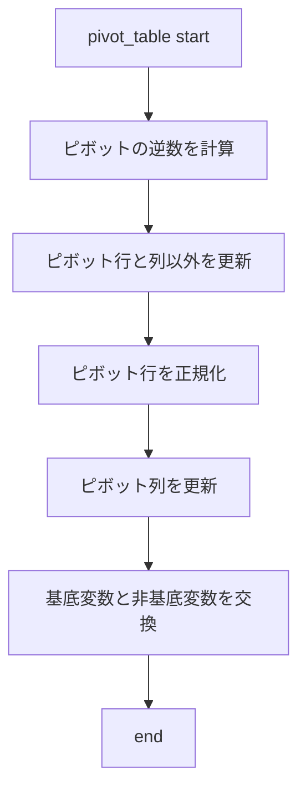
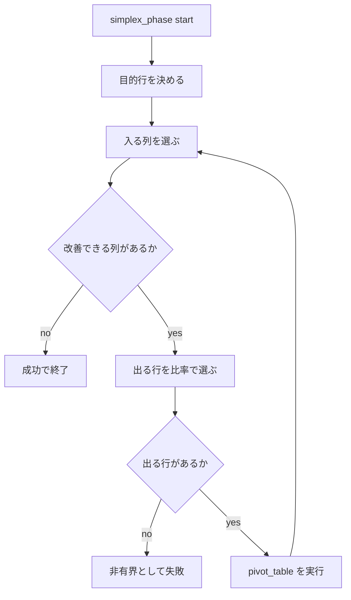
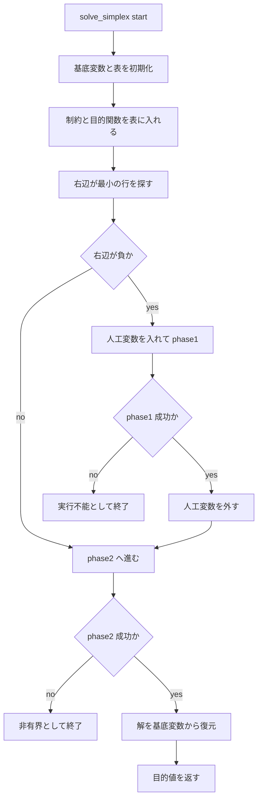
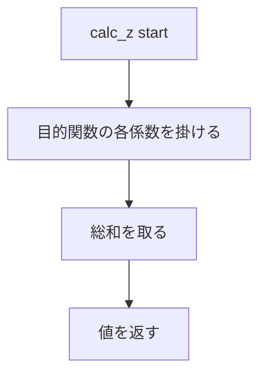
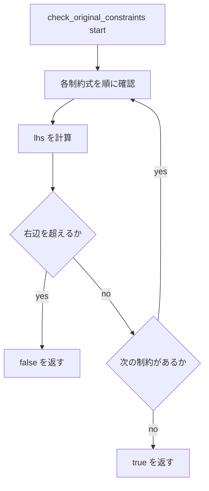
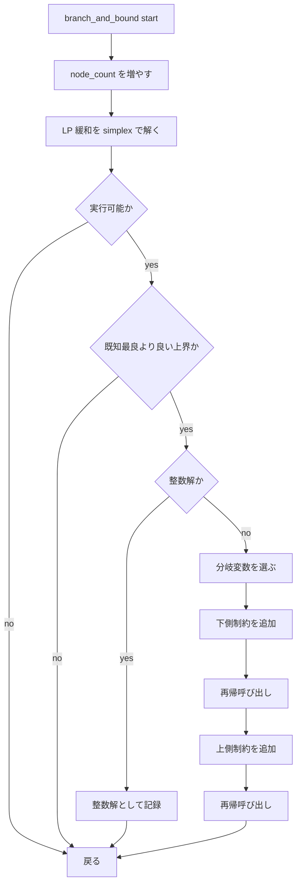
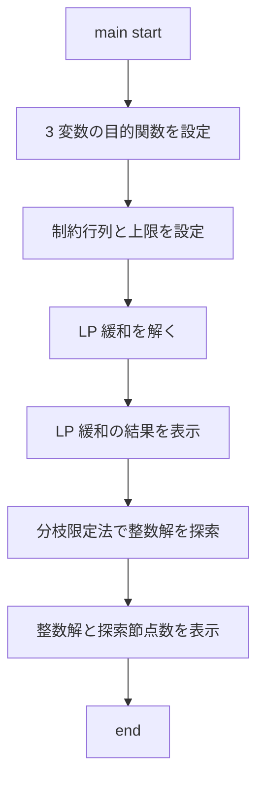

# 課題4
## 整数線形計画法によるつけ麺の売上最大化

### フローチャート

#### `pivot_table`

#### `simplex_phase`

#### `solve_simplex`

#### `calc_z`

#### `check_original_constraints`

#### `branch_and_bound`

#### `main`

### プログラム
- [ramen.cpp](ramen.cpp) 動作確認用の実装
- [ramen_all.cpp](ramen_all.cpp) 全探索による検算用

### 実行結果
- [test.sh](test.sh) で `ramen.cpp` をコンパイルして実行した。
- 実行結果は [result.txt](result.txt) に保存した。
- [test_ramen_all.sh](test_ramen_all.sh) で `ramen_all.cpp` をコンパイルして実行した。
- 実行結果は [ramen_all_result.txt](ramen_all_result.txt) に保存した。

`ramen.cpp` の実行結果では、LP 緩和の解が

- `x1 = 35.5555555556`
- `x2 = 6.6666666667`
- `x3 = 20.0000000000`
- `z = 58555.5555555556`

となり、整数制約を満たさないことが分かった。

その後、分枝限定法で整数解を探索した結果、

- `x1 = 35`
- `x2 = 7`
- `x3 = 20`
- `z = 58400`

を得た。

`ramen_all.cpp` の全探索結果も

- `豚鶏Wつけ麺: 35個`
- `鶏特盛つけ麺: 7個`
- `デラックスつけ麺: 20個`
- `最大売上: 58400円`

となり、分枝限定法の結果と一致した。

### 解説
- `pivot_table` はピボット操作の本体で、表の更新と基底変数の入れ替えを行う。
- `simplex_phase` は単体法の1段階分を進める処理で、改善できる列と出る行を選びながらピボットを繰り返す。
- `solve_simplex` は表の初期化から二段階シンプレックス法の実行、最終的な解の復元までをまとめて行う。
- `calc_z` は整数解 `x` から目的関数値を計算する。
- `check_original_constraints` は、丸めた整数解が元の制約を満たしているかを確認する。
- `branch_and_bound` は、LP 緩和の解が整数でないときに分岐して再帰的に探索し、最良の整数解を更新する。
- `main` は問題設定、LP 緩和の表示、分枝限定法による整数解探索、結果表示を順に実行する。
- `ramen_all.cpp` は全探索で同じ問題を解き、`58400` 円が最適値であることを検算している。
