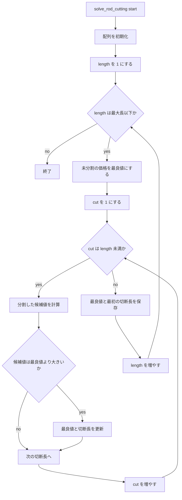
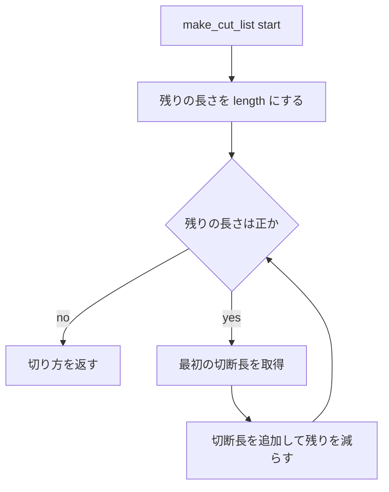
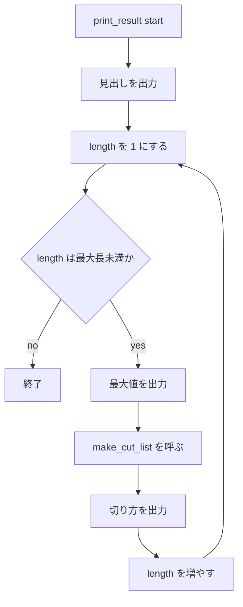
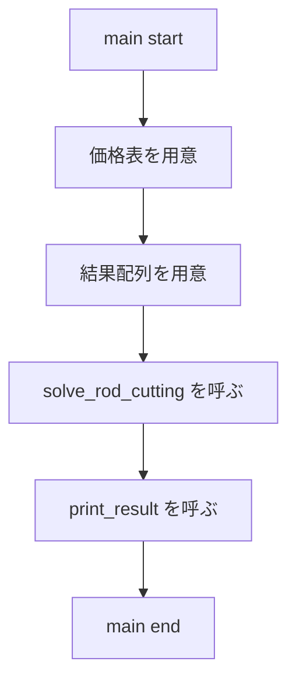

# 課題5
## 動的計画法によるロッド切り出し問題

### フローチャート

#### `solve_rod_cutting(price, max_value, first_cut)`


#### `make_cut_list(length, first_cut)`


#### `print_result(max_value, first_cut)`


#### `main()`


### プログラム
- [rod_cutting.cpp](rod_cutting.cpp)

### 実行結果
価格表は、ロッドの長さ`i`に対して次の価格を使用した。

```text
┌───────────┬─────┬─────┬─────┬─────┬─────┬─────┬─────┬─────┬─────┬─────┐
│ length    │ 1   │ 2   │ 3   │ 4   │ 5   │ 6   │ 7   │ 8   │ 9   │ 10  │
├───────────┼─────┼─────┼─────┼─────┼─────┼─────┼─────┼─────┼─────┼─────┤
│ price     │ 1   │ 5   │ 8   │ 9   │ 10  │ 17  │ 17  │ 20  │ 24  │ 30  │
└───────────┴─────┴─────┴─────┴─────┴─────┴─────┴─────┴─────┴─────┴─────┘
```

[test.sh](test.sh)でコンパイルと実行を行った。

[実行結果](result.txt)

実行結果は次の通りである。

```text
┌───────────┬─────┬─────┬─────┬─────┬─────┬─────┬─────┬─────┬─────┬─────┐
│ n         │ 1   │ 2   │ 3   │ 4   │ 5   │ 6   │ 7   │ 8   │ 9   │ 10  │
├───────────┼─────┼─────┼─────┼─────┼─────┼─────┼─────┼─────┼─────┼─────┤
│ max_value │ 1   │ 5   │ 8   │ 10  │ 13  │ 17  │ 18  │ 22  │ 25  │ 30  │
├───────────┼─────┼─────┼─────┼─────┼─────┼─────┼─────┼─────┼─────┼─────┤
│ cut       │ 1   │ 2   │ 3   │ 2+2 │ 2+3 │ 6   │ 1+6 │ 2+6 │ 3+6 │ 10  │
└───────────┴─────┴─────┴─────┴─────┴─────┴─────┴─────┴─────┴─────┴─────┘
```

### 解説
- `solve_rod_cutting`は、長さが短いロッドの最適値を利用して、長さが1から10までの最適値を順番に計算する。
- 長さ`length`を最初の切断長`cut`と残りの長さ`length - cut`に分けたとき、候補値は`price[cut] + max_value[length - cut]`である。
- 切らずにそのまま販売する場合も候補に含めるため、最初は`price[length]`を最良値としている。
- `max_value[length]`には長さ`length`の最大値を保存し、`first_cut[length]`にはその最大値を得る最初の切断長を保存する。
- `make_cut_list`は、`first_cut`を順に参照して、保存された切断長から実際の切り方を復元する。
- `print_result`は、長さごとの最大値と切り方を表形式で出力する。
- `main`は価格表を設定し、動的計画法による計算と結果の出力を順に行う。
- 動的計画法では、同じ長さの部分問題を何度も再計算せず、`max_value`に保存した値を再利用する。そのため、単純な再帰より効率よく計算できる。

また表に使用する記号を出すためにGPT 5.6 Lunaを使用した
